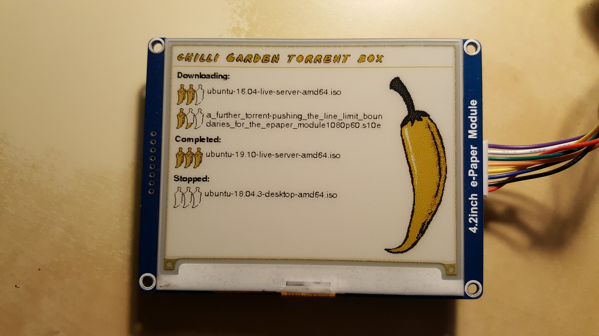

# torrent_box_epaper_display

###### Raspberry Pi torrent box e-paper display for waveshare 4.2 inch colour epaper



## Pre-requisites:

Requires the user to have set up their wave-share 4.2 inch b/c module with a Raspberry pi with python3 following the
guides under the resources tab here:
https://www.waveshare.com/wiki/4.2inch_e-Paper_Module_(B)

**IMPORTANT: This project uses python 3 so you need to have installed the python 3 modules mentioned in the waveshare 
instruction above**

Also requires transmission to have been set up on the local machine with the network UI like here: 
https://pimylifeup.com/raspberry-pi-transmission/

## Installation:
1. Follow the steps above to install transmission and get the waveshare epaper demo running
2. Clone this repo
    ```bash
    git clone https://github.com/myx360/torrent_box_epaper_display.git
3. Go to the within the project directory run
    ```bash
    cd torrent_box_epaper_display
    sudo pip3 install PyYAML
4. At this point, if you would just like to test the display, trying running the following with
your username and password for the transmission client. Remember to stop it before the next step.
(you can close the program using ctrl + c)
    ```bash
    python3 main.py username password
5. Setup the torrent display as a service by running the install_as_a_service.sh script,
following the instructions, then enable the service.
    ```bash
    sudo ./install_as_a_service.sh
    sudo systemctl enable epaper_display

## Disclaimer:
1. The install_as_a_service script stores your username and password to the transmission daemon in a config file,
config.yml in order to use those details when polling the transmission daemon. This file should be left only readable by
root, and obviously will be readable by the root user no matter what, so don't re-use this password. I accept no
responsibility for any risks caused by or associated with this. Some encryption may come in a future release, but even
then any user with root access will be able to decrypt it.
